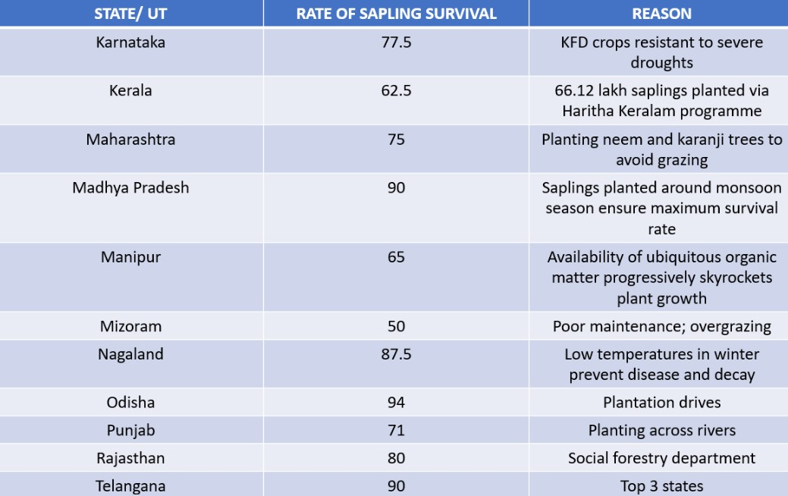
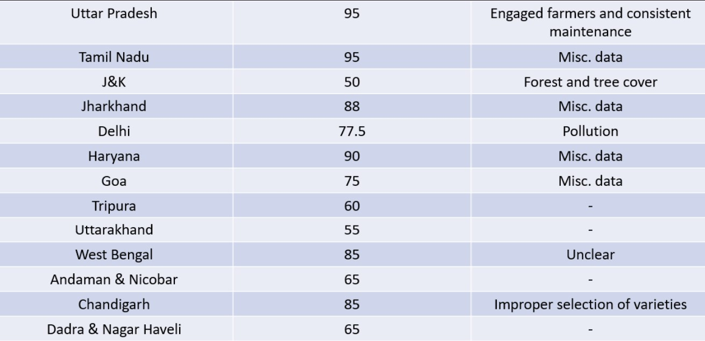

# KRISHINETRA

A website for Forest Department of India to tracking all individual sapling by taking benefit Social Media 

### Working Screenshots

|              |               |                                        |
| :----------------------------------: | :------------------------------------: | :----------------------------------------------------------------------------: |
|          _Crop prediction_           |      _Plant health Detection_          |                                 _Web Application_                              |

### Problem Statement

In India, people show interest in planting saplings, but most of them are left unattended and either grow out or wither away.
This calls for a unified system intended to distribute saplings to the people and track their status. 

### Research

### Conclusion
Sapling survival rates in India are low because:

1.People lose interest in taking care of sapling 

2.Individual level monitoring is difficult 

3.Variable Climatic conditions and soil profile 

     AIM :Right Person Right Place
     

### Key Features 

1. Documented log of users and saplings distributed using Instagram 
2. Crop prediction using location and image 
3. Weekly and monthly user reports via Instagram stories/post 
4. Disease and growth detection using ML 
5. Social credit system to boost engagement 
6. POI algorithm minimizes loss of saplings 
7. Validation via Captcha 

### ML Prebuild Models used

CROP PREDICTION ML MODEL (Random Forest Algorithm) - https://github.com/Phantom-Studiosad/Intelligent_CropPrediction_System

PLANT DISEASE DETECTION (CNN) - https://github.com/manthan89-py/Plant-Disease-Detection.git

### Setup

##How to use the software

1.Installing on libraries

      pip install -r requirements.txt
2.Running the website

    uvicorn backend:app --reload
3.Running the instagram Bot server

    python -u "instagram_bot\Instagram_checker.py"
    

